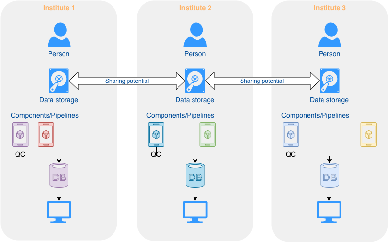
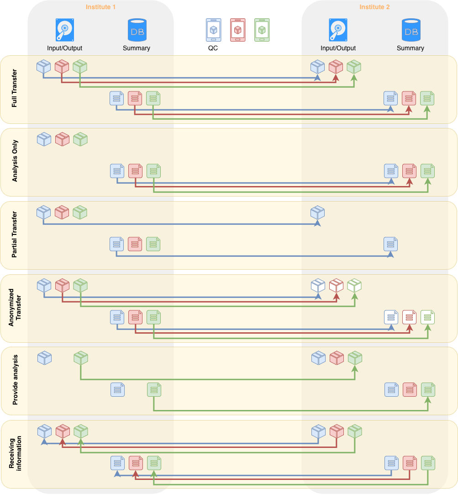

# Data Sharing (WIP)

Data sharing is one of the pillars that bifrost was developed around for Staten Serum Institut and the other regions in Denmark. Part of this is to acknowledge what we see as the current model for sharing data and that not everything can currently be shared between stakeholders so how can we maximize what we're allowed to share and allow flexibility in sharing for down the road. 

## Sharing model currently

This is how we currently view sharing of data between different places. Everyone runs their own components of pipelines and analysis and if data is shared that data has to be shared as raw data to be reprocessed in local pipelines. Some analysis will not be done at different locations and results from one location to another will always be suspect because the workflow to reach the results are not the same.

## Sharing model with bifrost

Bifrost provides a platform so the components save data in a common structured DB format and that components with versions are unique within the system so that if another institute ran the same component you can be sure they got the same results. This allows summarized results to be shared at a database level and not only at the raw read level. On top of that you can share summarized results without sharing read/output information which can match your local sharing policy. By providing common pipelines and allowing people to develop their own it should be a platform for sharing. 

## Types of sharing

## Further sharing 
