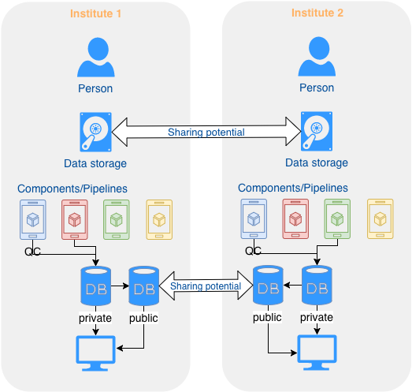

# Data Sharing (WIP)

Data sharing is one of the pillars that bifrost was developed around for Staten Serum Institut and the other regions in Denmark. Part of this is to acknowledge what we see as the current model for sharing data and that not everything can currently be shared between stakeholders so how can we maximize what we're allowed to share and allow flexibility in sharing for down the road. 

## Sharing model currently

This is how we currently view sharing of data between different places. Everyone runs their own components of pipelines and analysis and if data is shared that data has to be shared as raw data to be reprocessed in local pipelines. Some analysis will not be done at different locations and results from one location to another will always be suspect because the workflow to reach the results are not the same. 

## Sharing model with bifrost

Bifrost provides a platform so the components save data in a common structured DB format and that components with versions are unique within the system so that if another institute ran the same component you can be sure they got the same results. This allows summarized results to be shared at a database level and not only at the raw read level. On top of that you can share summarized results without sharing read/output information which can match your local sharing policy. By providing common pipelines and allowing people to develop their own it should be a platform for sharing. 

## Types of sharing

This is all the methods of sharing we currently envision
- Full Transfer: Transfer input/output and shared data from one institute to another, this provides as much as possible to both sides.
- Analysis Only: Transfer the summarized results of components but not the Input/Output of the data. 
- Partial Transfer: In the case of the QC component it provides the raw basic data, the output of it, and the summarized data but not the other information regarding other components
- Anonymized Transfer: This mixes with other transfer types but the idea is you can send information and either change values in what you send or mask them out. A use case could be to share information with the public and masking our private information. The goal would also be that the sender gets a record of the mapping/masking to be able to do lookups for additional information if need be.
- Provide Analysis: This is a partial transfer but in this case the sample has been processed on the recieving institute for some components but not the one being transfered. This could be useful for large analysis that you don't want to preform multiple times or that each Institute shares the runtime burden.
- Recieving Information: Of course all previous steps can be reversed as well.

## Further sharing 

Going forward we are also exploring a share model where both public and private data exist in one location. The idea is that the public data can be shared freely and can be a subset of the private data or a masked version. This is being explored with projects related to more international data sharing.